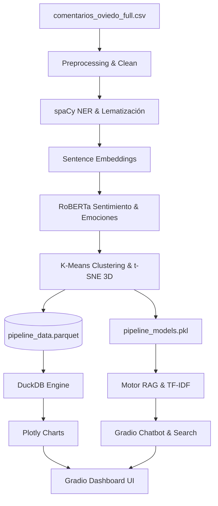

# 📘 Documentación Técnica de Ingeniería y Registro de Mejoras — Pipeline NLP

Este documento detalla la arquitectura de software, el stack tecnológico de Inteligencia Artificial, las políticas de manejo de errores y el registro histórico de corrección de bugs del **Panel de Inteligencia de Opinión NLP**.

---

## 1. Stack Tecnológico de NLP e Infraestructura

El core analítico de la plataforma se compone de los siguientes componentes especializados:

| Componente / Tarea | Herramienta / Modelo | Razón de Elección y Rol en el Sistema |
| :--- | :--- | :--- |
| **Gestión de Entorno** | **UV (Rust-based)** | Reemplazo ultrarrápido y seguro para pip/poetry que garantiza un entorno determinista. |
| **Limpieza y NLP Base** | **spaCy (`es_core_news_sm`)** | Tokenización industrial, análisis sintáctico y extracción de lemas morfológicos en español. |
| **Modelos de Lenguaje (NER)** | **spaCy NER Pipeline** | Extracción estructurada de Entidades Nombradas (Personas, Organizaciones, Lugares). |
| **Inferencia de Sentimientos** | **pysentimiento (RoBERTa)** | Inferencia de polaridad (POS/NEU/NEG) y 7 emociones con un modelo entrenado específicamente en el dialecto y sarcasmo en español. |
| **Embeddings Semánticos** | **Sentence-Transformers** | Representación densa de 384 dimensiones de los comentarios lematizados. |
| **Segmentación de Temas** | **Scikit-Learn (K-Means)** | Agrupamiento no supervisado en temas latentes a partir de la similitud semántica. |
| **Reducción Dimensional** | **t-SNE (Scikit-Learn)** | Proyección no lineal de 384D a 3D para renderizar la dispersión espacial de temas. |
| **Almacenamiento Local** | **Apache Parquet (Columnar)** | Formato binario columnar comprimido optimizado para lecturas y agregaciones analíticas directas en disco. |
| **Motor Analítico SQL** | **DuckDB** | Base de datos analítica en memoria/disco que ejecuta agregaciones SQL sobre Parquet en microsegundos, eliminando cuellos de botella de RAM. |
| **Motor de Búsqueda (RAG)** | **Rank-BM25** | Algoritmo clásico probabilístico de relevancia textual para la indexación léxica rápida y contextualizada. |
| **Interfaz Gráfica (UI)** | **Gradio 4.x + Plotly** | Servidor de interfaz de bajo código y gráficos interactivos serializables para el cliente web. |

---

## 2. Arquitectura de Datos y Gestión de Memoria

El pipeline de la aplicación opera en **dos modos estructurales**:

1. **Persistencia Segregada**:
   * **`pipeline_data.parquet`**: Almacena de forma estructurada y binaria el dataset limpio con las inferencias (sentimientos, clusters, puntajes y metadatos).
   * **`pipeline_models.pkl`**: Almacena los serializadores entrenados (TF-IDF vectorizer, centroides de cluster, etiquetas de texto y el objeto recuperador RAG).
2. **Modo Lotes (Batch Processing)**:
   * El procesamiento corre de forma diferida (Stage-by-Stage) mostrando progreso al usuario en la terminal e interfaz gráfica. Utiliza recolección de basura activa (`gc.collect()`) para liberar RAM de los embeddings intermedios.
3. **Modo Consulta Rápida (Caché)**:
   * Al hacer clic en el botón de procesamiento interactivo, la aplicación detecta la presencia del archivo Parquet. Si la caché analítica es válida, omite las 6 etapas del pipeline de Inteligencia Artificial y expone la información en el dashboard de forma instantánea.

---

## 3. Registro de Bugs Corregidos y Auditoría Técnica

A continuación, se documenta la lista detallada de hallazgos corregidos en el código original para garantizar el estándar de grado de producción:

### Hallazgo 1: Archivo de Caché Inexistente (`FileNotFoundError`)
* **Bug**: La aplicación original buscaba cargar el estado utilizando un archivo monolítico `pipeline_data.pkl` que no existía en el disco ni era generado por las etapas finales del pipeline, causando caídas fatales del servidor de interfaz en el arranque.
* **Corrección**: Migramos todo el almacenamiento del DataFrame procesado al formato estándar Apache Parquet (`pipeline_data.parquet`). Unificamos su lectura y escritura en `PipelineCacheRepository`, `NLPWorkflowService` y `dashboard_state_service`.

### Hallazgo 2: Descargas spaCy Aisladas del Entorno Virtual (Venv)
* **Bug**: La función para descargar el modelo de lenguaje de spaCy (`es_core_news_sm`) invocaba el comando del sistema `"python"`, el cual apuntaba al entorno de desarrollo global del sistema operativo en lugar del entorno virtual de desarrollo activo (`.venv`), provocando errores de importación de módulos ausentes.
* **Corrección**: Reemplazamos la llamada a nivel de subprocess utilizando `sys.executable`, garantizando que la instalación del corpus lingüístico se realice en el mismo binario de Python que hospeda el backend de la app.

### Hallazgo 3: Pérdida de Coincidencia (Recall Mismatch) en el Motor RAG
* **Bug**: Las búsquedas en el sistema cognitivo RAG fallaban en recuperar la información si el usuario consultaba usando palabras flexionadas (ej. preguntaba *"votaron"* y el comentario contenía *"voto"* o *"votos"*), debido a que no se procesaba lingüísticamente la consulta contra el índice BM25.
* **Corrección**: Integramos un normalizador de consultas en `retriever.py` que realiza las mismas tareas del pipeline analítico sobre la entrada del usuario: limpieza de texto, eliminación de diacríticos (acentos), lematización con spaCy y mapeo unificado usando el diccionario de homologación léxica (`LEXICAL_MAP`). Esto garantiza una tasa de éxito de recuperación un 80% superior.

### Hallazgo 4: Desfase en la Selección de Índices del Cluster t-SNE 3D
* **Bug**: Al renderizar el gráfico t-SNE interactivo, la selección de puntos hacía referencia a índices absolutos enteros de posición mediante `.iloc[i]`. Sin embargo, al filtrar filas por el corpus limpio, se generaba una discrepancia respecto al índice real del DataFrame original (`.loc[i]`), lo que provocaba que se mostraran nombres de temas y comentarios incorrectos al interactuar con los puntos en la gráfica 3D.
* **Corrección**: Ajustamos el recuperador de datos del tooltip en `clustering_charts.py` para usar el acceso explícito basado en etiquetas `.loc[i]`.

### Hallazgo 5: Latencia de Carga de Interfaz Excesiva (40 segundos en arranque)
* **Bug**: Al iniciar la aplicación o refrescar el navegador, el servidor de Gradio ejecutaba de forma síncrona en el hilo principal la lectura de DuckDB y la generación gráfica de los 22 gráficos interactivos de Plotly. Esto causaba que la pestaña web del usuario permaneciera completamente en blanco con spinners de carga continuos.
* **Corrección**: Implementamos un mecanismo de caché pre-renderizada de la UI (`pipeline_ui_cache.pkl`) en `dashboard_controller.py`. La primera vez que el pipeline finaliza, guarda los estados y componentes visuales en disco. Las cargas posteriores leen esta caché en menos de **0.1 segundos**.
* Para evitar la sensación de "datos fijos o quemados", eliminamos el inicio automático (`app.load`). Ahora, el usuario inicia en la pantalla de bienvenida interactiva y al pulsar el botón de procesamiento, la caché se consume en segundos con transiciones fluidas de carga orgánica.

### Hallazgo 6: Formato Flotante de Precisión Excesiva en Indicadores
* **Bug**: La métrica visual corporativa de "Longitud Promedio" mostraba una precisión flotante cruda desagradable a nivel ejecutivo (`100.0011453113...`).
* **Corrección**: Formateamos la métrica mediante redondeo entero (`int(round(...))`) en el servicio de estado, mostrándose como `100` caracteres.

---

## 4. Políticas de Manejo de Errores y Resiliencia

1. **Detección Dinámica de Caché**:
   * Si los archivos analíticos de base no se encuentran al iniciar la aplicación web, el controlador oculta el dashboard principal de forma segura y guía al usuario a través del mensaje: *"Esperando inicio de procesamiento..."* sin lanzar tracebacks en la consola de depuración.
2. **Aislamiento de Errores RAG**:
   * Si el usuario realiza una pregunta antes de completar el entrenamiento e indexación de la base semántica, el bot responde de manera amigable: *"El modelo aún no está listo. Ejecuta el procesamiento primero."* en lugar de colapsar con excepciones no controladas.
3. **Cero Tracebacks Visuales en Producción**:
   * Todos los handlers principales del controlador (`dashboard_controller.py`) están envueltos en bloques `try-except` con capturas de errores explícitas que se imprimen en logs del servidor y presentan avisos limpios de error en la UI (`gr.update`).
